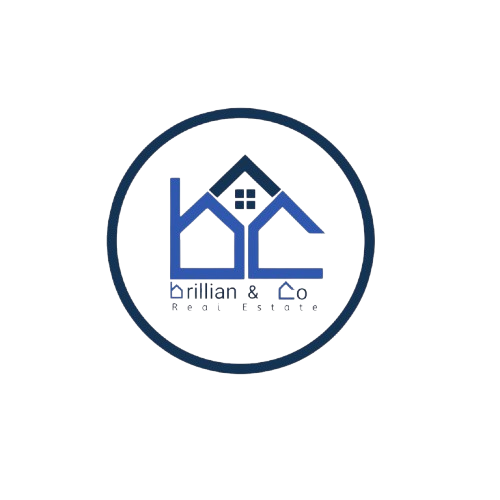

# Brillian & Co - Real Estate Platform

<p align="center">
    
</p>

<p align="center">
    <a href="https://bricoree.com">🌐 Live Website</a> |
    <a href="https://bricoree.com/admin">⚙️ Admin Panel</a>
</p>

## 🏢 About Brillian & Co

Brillian & Co is a modern real estate platform built with **Laravel 12** and **Backpack for Laravel**. The platform provides a comprehensive solution for managing properties, lands, team members, and real estate services with a beautiful public-facing website and a powerful admin dashboard.

### ✨ Key Features

- 🏠 **Property Management** - Complete CRUD for residential and commercial properties
- 🌾 **Land Listings** - Manage land sales with detailed specifications
- 👥 **Team Management** - Showcase team members with social links
- 🛠️ **Service Management** - Manage real estate services and specialities
- 📱 **Responsive Design** - Mobile-first approach with modern UI
- 🔐 **Admin Dashboard** - Powerful Backpack-powered admin interface
- 🎨 **Dark/Light Mode** - User preference with dark mode as default
- 📊 **Analytics** - Visitor tracking and engagement metrics

## 🛠️ Technology Stack

- **Backend**: Laravel 12.12.0 (PHP 8.2+)
- **Admin Panel**: Backpack for Laravel 6.x
- **Frontend**: Vite, Bootstrap 5, SCSS
- **Database**: MySQL
- **Deployment**: Hostinger with GitHub Actions CI/CD
- **Assets**: Basset (Backpack's asset management system)

## 🚀 Live Website

- **Main Site**: [https://bricoree.com](https://bricoree.com)
- **Admin Panel**: [https://bricoree.com/admin](https://bricoree.com/admin)

## 📋 Prerequisites

- PHP 8.2 or higher
- Composer
- Node.js 20+ and npm
- MySQL database
- Git

## 🔧 Local Development Setup

### 1. Clone the Repository
```bash
git clone https://github.com/CC-Platforms/BrillianAndCo.git
cd BrillianAndCo
```

### 2. Install Dependencies
```bash
# Install PHP dependencies
composer install

# Install Node.js dependencies
npm install
```

### 3. Environment Configuration
```bash
# Copy environment file
cp .env.example .env

# Generate application key
php artisan key:generate
```

### 4. Database Setup
```bash
# Configure your database in .env file
DB_CONNECTION=mysql
DB_HOST=127.0.0.1
DB_PORT=3306
DB_DATABASE=brillian_co
DB_USERNAME=your_username
DB_PASSWORD=your_password

# Run migrations and seeders
php artisan migrate --seed
```

### 5. Storage and Assets
```bash
# Create storage symlink
php artisan storage:link

# Build frontend assets
npm run build

# Set up Backpack assets
php artisan basset:cache
```

### 6. Start Development Server
```bash
php artisan serve
```

Visit `http://localhost:8000` to view the application.

## 🚀 Production Deployment

### Automated Deployment (Recommended)
The project uses **GitHub Actions** for automatic deployment to Hostinger:

1. **Push to main branch** - Deployment triggers automatically
2. **Monitor progress** - Check GitHub Actions tab
3. **Verification** - Visit the live site to confirm deployment

### Manual Deployment Steps
For manual deployment or troubleshooting:

```bash
# SSH into your server
ssh -p 65002 u995357878@82.25.96.67
cd domains/bricoree.com/public_html/

# Pull latest changes
git pull origin main

# Install dependencies
composer install --no-dev --optimize-autoloader

# Build assets
npm run build

# Run Laravel optimizations
php artisan migrate --force
php artisan optimize:clear
php artisan basset:clear
php artisan basset:cache
php artisan optimize
```

## 🎨 Styling and Customization

### Backpack Customization
- **Dark Mode Default**: Configured in `config/backpack/theme-tabler.php`
- **Light Mode Fixes**: Custom CSS in `public/assets/css/light-mode-fixes.css`
- **Admin Styling**: Additional overrides in `public/assets/css/backpack-fixes.css`

### Frontend Assets
- **Main Styles**: `public/assets/scss/style.scss`
- **Components**: Modular SCSS in `public/assets/scss/sections/`
- **Build Process**: Vite configuration in `vite.config.js`

## 📁 Project Structure

```
├── app/
│   ├── Http/Controllers/
│   │   ├── Admin/          # Backpack CRUD controllers
│   │   └── Web/           # Frontend controllers
│   ├── Models/            # Eloquent models
│   └── Services/          # Business logic services
├── resources/
│   ├── views/
│   │   ├── components/    # Reusable Blade components
│   │   ├── sections/      # Homepage sections
│   │   └── layouts/       # Page layouts
│   └── scss/              # SCSS source files
├── public/assets/         # Compiled assets
├── database/
│   ├── migrations/        # Database schema
│   └── seeders/          # Sample data
└── config/backpack/       # Backpack configuration
```

## 🔐 Admin Panel

### Default Admin Access
- **URL**: `/admin`
- **Default Credentials**: Set up during seeding

### Available CRUD Operations
- **Properties** - Manage property listings
- **Lands** - Handle land sales
- **Team Members** - Team management with social links
- **Services** - Real estate services
- **Specialities** - Service categories
- **Facilities** - Property amenities

## 🐛 Troubleshooting

### Common Issues

**Basset Assets Not Loading**
```bash
php artisan basset:clear
php artisan basset:cache
```

**Storage Files Not Accessible**
```bash
php artisan storage:link
# For Hostinger: Create additional symlink
ln -s public/storage storage
```

**Team Section Errors**
Ensure social links are properly formatted as JSON in the database.

### Development Commands
```bash
# Clear all caches
php artisan optimize:clear

# Rebuild views
php artisan view:clear

# Reset Backpack assets
php artisan basset:fresh
```

## 🤝 Contributing

1. Fork the repository
2. Create a feature branch: `git checkout -b feature/amazing-feature`
3. Commit changes: `git commit -m 'Add amazing feature'`
4. Push to branch: `git push origin feature/amazing-feature`
5. Open a Pull Request

## 📄 License

This project is licensed under the MIT License - see the [LICENSE](LICENSE) file for details.

## 🆘 Support

For support and questions:
- **Email**: support@bricoree.com
- **Issues**: [GitHub Issues](https://github.com/CC-Platforms/BrillianAndCo/issues)

---

<p align="center">
    Built with ❤️ using Laravel & Backpack for Laravel
</p>
